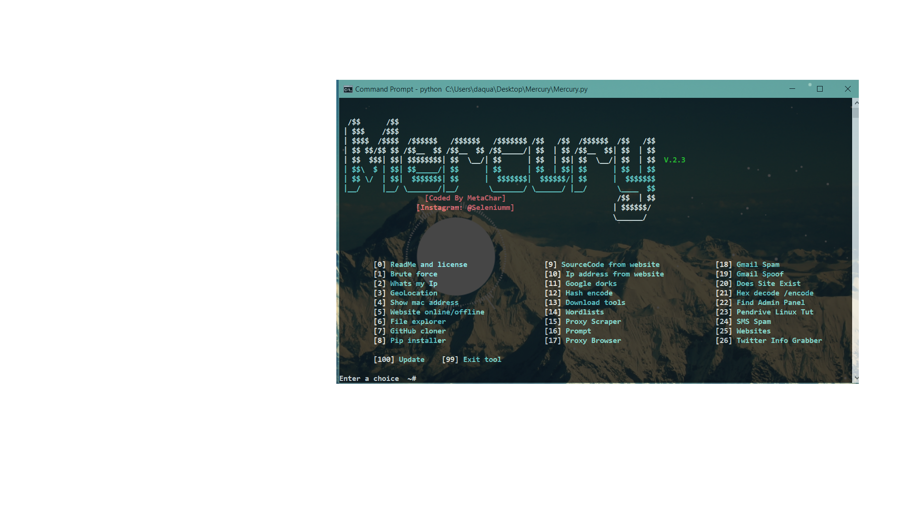

Main Menu
======

Installation
=====
Requires Python2 (Linux)
```
apt-get install python2
```


```
git clone https://www.github.com/MetaChar/Mercury
```


```
pip install -r requirements.txt
```


Features
======

##### BruteForce
Mercury uses Selenium to automatically
input passwords into a website


##### GeoLocation
Gelocation allows the user to pin point the
exact location of the ip address


##### Sms Spam
Uses gmail to spam sms


##### Spoof Email
Sends anonymous emails


##### Check If Website Exists
Mercury checks if the website is real


##### Check if Website Is Down
Checks if websites status is online or offline


##### Encode Strings Into Hash Form
Encodes your text into hash form


##### Hex Encode/Decode
Encodes and decodes hex strings 


##### Whats My Ip & Mac
shows mac and ip address


##### Spam email
spams email in While True loop


##### Download Extra Tools
Download an extra 16 tools like hydra, metasploit and nmap


#####  Github Cloner & Pip Intsaller
Installs Pips and Github repos


##### Website Cloner
Extracts the source code from a website


##### Ip Address From Website
Finds ip address from website


##### nmap
Nmap must be pre installed
and its somewhat glitchy on linux


##### Port Listen
Listens to ports

#### DOS 
dos attack via packets


##### AnonWebbrowser
Loads up Chrome, with a proxy


##### Google Dorks
Finds vulrnable links


##### Admin Pannel
Helps find the admin pannel to a website


##### Websites
Access some of the best hacking & robotoics websites.


##### Proxy Scraper
Find the best Us proxys!


##### Twitter Info Grab

Grab a twitter users basic info